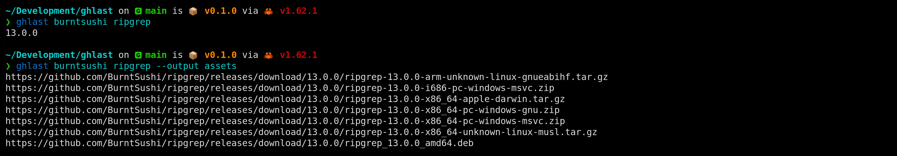
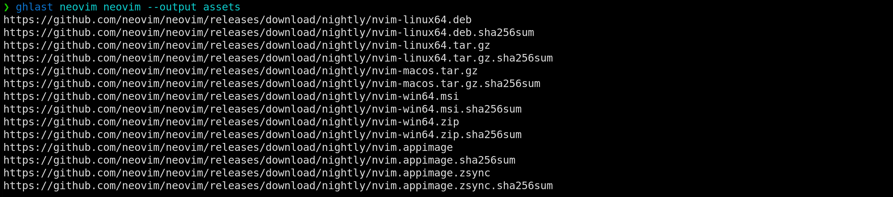

# ghlast

[](https://crates.io/crates/ghlast)
[](https://github.com/nickjer/ghlast/releases)
[](https://github.com/nickjer/ghlast)
[](https://github.com/nickjer/ghlast/actions)

A command line interface (CLI) used to inspect the last release published to a
GitHub repository.



## Why

One benefit this has over just bookmarking a URL to
`/owner/name/releases/latest/download/asset-name.zip` is that this CLI will
pick up pre-releases.

For instance at the time of writing this the [Neovim] project has a v0.8.0
prerelease build that they tag as `nightly`. If you use the static URL above
you will instead get the stable v0.7.2 build instead.



[Neovim]: https://github.com/neovim/neovim

## Installation

Install using [cargo]:

```shell
cargo install ghlast
```

[cargo]: https://doc.rust-lang.org/cargo/

## Pre-compiled Binaries

An alternative method is to download and run the pre-compiled binaries:

https://github.com/nickjer/ghlast/releases
